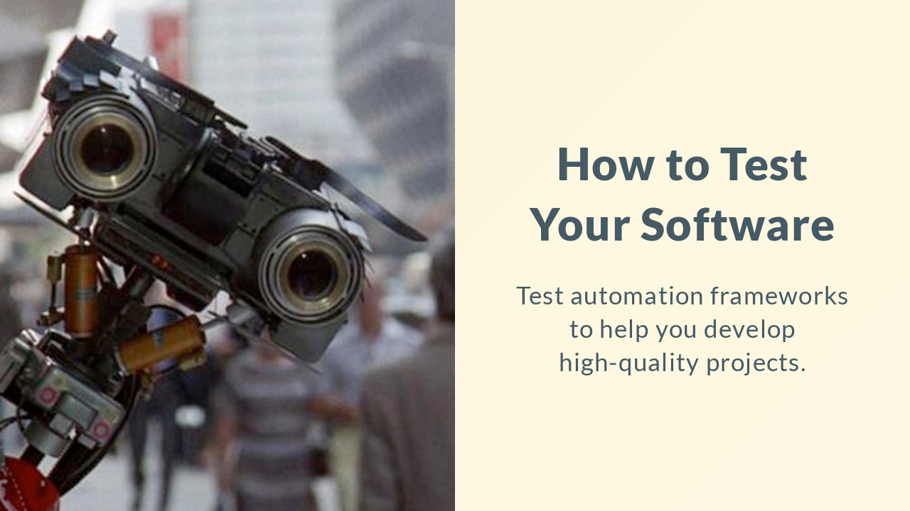

# Test Automation Workshop

This repository contains code samples and slides for our workshop.

- Refer to `slides/` to check light talks slides.
- Refer to `examples/` to check code examples for covered languages.

## Clone example apps

You will want to clone the apps inside `examples/[language]/[app]` before
tests were added, refer to `-no-tests` tags for these versions and check
the README of each one for instructions on how to run.
